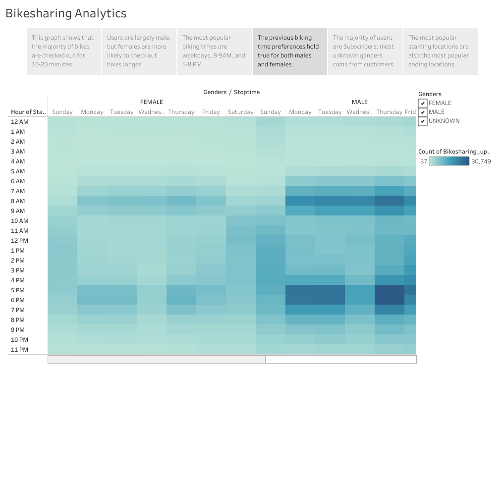
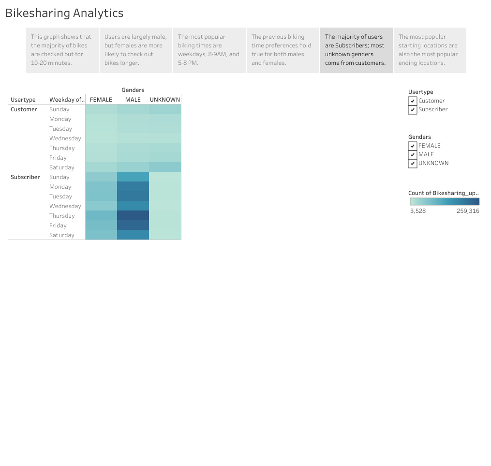

# Bikesharing Analysis
## Overview of Statistical Analysis
The purpose of this analysis is to gain a deeper understanding of bike-sharing in New York and how users utilize the program so that investors can determine if a similar bike-sharing program would thrive in Des Moines, Iowa. Using data from Citi Bike, a bike-sharing program in New York, I have compiled a series of data visualizations that explore facets of Citi Bike's bike trips, such as its userbase, durations, time of use, and locations. These visualizations can be found in a [Tableau Dashboard](https://public.tableau.com/app/profile/davidil/viz/BikesharingAnalytics/BikesharingAnalytics).
## Results
The results of this data analysis can be broken down into three sections: trip duration, time preference, and location.
### Trip Duration

This first graph shows how long the bikes are checked out for, divided into both hours and minutes. The majority of bikes are checked out no longer than 20 minutes, with very few being checked out for longer than an hour. The peak trip duration is approximately 10 minutes.

This graph shows how long bikes are checked out, separated by gender. It shows that the majority of users are male, and that both males and females have a similar trip duration pattern with females skewing slightly towards longer trips. The unknown gendered appear to have a more even distribution of trip durations.

### Time Preference

This heatmap shows that the most popular biking times are weekdays from 8:00-9:00 AM and 5:00-8:00 PM. Mid-day on weekdays sees less bike traffic, but bike usage on weekends is spread throughout mid-day and afternoon.

Similar to the previous heatmap, this map shows the popular times of day for bike usage, but is divided between genders. The male graph has darker coloration due to males being the majority users, but the general shapes of the graphs are the same. This indicates that the time preferences of bike-share users are not dependent on gender.

This graph displays bike usage per day of the week, and is divided into both genders and user types. The darker coloration of the Subscriber graph indicates that the majority of users are Subscribers. Also, the Subscriber graph has more variation in bike usage per weekday, while Customers have an almost uniform usage pattern. Finally, almost all of the unknown gender usage occurs in the Customer userbase.
### Location

This shows two maps side-by-side. The blue map shows bike starting locations, with the larger and darker markers indicating more bikes starting from those locations. The orange map shows the bike ending locations, with the larger and redder markers indicating more bikes ending at these locations. Both maps seem to share the same popular locations.

## Summary
Based off of these data visualizations, we can begin to draw some conclusions. First, we can conclude that most users prefer to use bike-sharing programs for relatively short trips. We can also see that user preferences are consistent across genders, both in trip durations and in time of day preferences. Next, we can see that the most popular time preferences for bike-sharing is weekday mornings and evenings. This usage pattern might indicate that a large portion of users use bike-sharing programs as transport to and from work. Also, the heatmap of User types showed that Subscribers make up a large portion of the userbase and are responsible for the time preference patterns across weekdays. We can presume that users become Subscribers because they anticipate a regular need for a bike in their daily/weekly schedules. Finally, we can observe that the most popular starting locations are the same as the popular ending locations, which could either mean that users typically return their bikes to the same place they started, or that most bike trips occur back-and-forth between the same popular locations. I propose that a new map be created that plots both the start and end locations for the bike trips, as well as a line connecting the two points. This will help determine bike trip patterns and provide answers for how the bike-share program is being used. A second visualization that would provide insight would be the two start and end location maps already created overlayed with map layers of notable locations. These would include housing, businesses, shops, and tourist locations. These maps might show if the popularity of certain bike-share locations is influenced by their surroundings.
